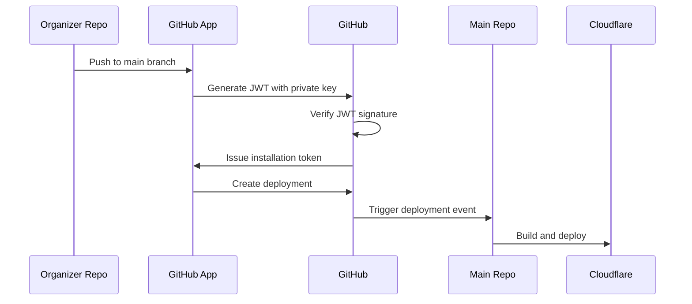
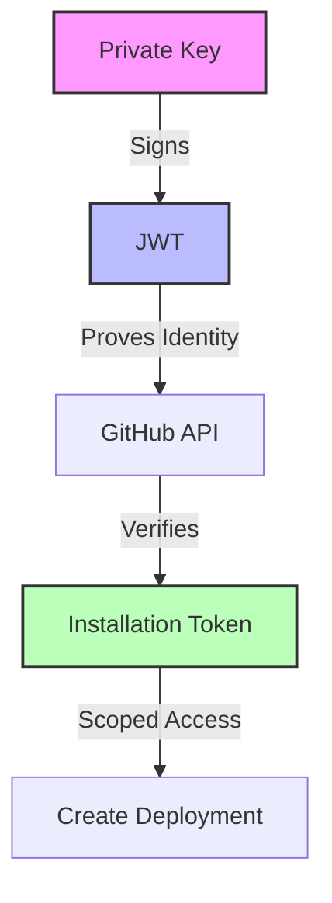

# GitHub App Deployment Setup Guide

This guide explains how to set up a GitHub App to handle deployments from organizer repositories to the main repository. This approach provides secure, scoped access for creating deployments without granting write access to repository contents.

## Overview

The setup uses a GitHub App to:
1. Allow organizer repositories to create deployments
2. Restrict access to only deployment-related actions
3. Maintain security through short-lived tokens and scoped permissions

## Prerequisites

1. Organization admin access on GitHub
2. Access to both:
   - The main repository (`ouroakley`)
   - The organizer repository

## Setup Steps

### 1. Create GitHub App

1. Go to your organization's settings → GitHub Apps → New GitHub App
2. Configure the app:
   - Name: "Deployment Manager" (or similar)
   - Description: "Manages deployments from organizer repositories"
   - Homepage URL: Your organization's website
   - Webhook: Leave disabled (not needed for deployments)
   - Permissions:
     - `Deployments`: Read & Write
     - `Contents`: Read-only
     - `Workflows`: Read-only
3. Click "Create GitHub App"
4. **IMPORTANT**: Download and save the private key (PEM file)

### 2. Install GitHub App

1. After creating the app, click "Install App"
2. Select both repositories:
   - The main repository (`ouroakley`)
   - The organizer repository
3. Note down the installation ID:
   - Go to the main repository's settings → GitHub Apps
   - Find your app and note the installation ID
   - This ID is needed to generate installation tokens that can create deployments in the main repository

### 3. Configure Organizer Repository

Add the following secrets to the organizer repository:

1. Go to organizer repository → Settings → Secrets and variables → Actions
2. Add these secrets:
   - `GITHUB_APP_PRIVATE_KEY`: The private key from step 1 (PEM format)
   - `INSTALLATION_ID`: The installation ID for the organizer repository
   - `TARGET_REPO`: The main repository name (e.g., `ouroakley/main`)

### 4. Update Workflow

In the organizer repository, update the workflow file:

```yaml
name: Trigger Main Repository Build

on:
  push:
    branches:
      - main

jobs:
  build:
    runs-on: ubuntu-latest
    steps:
      - name: Get Installation Token
        id: get_token
        uses: actions/github-script@v7
        with:
          script: |
            const app = require('jsonwebtoken');
            const now = Math.floor(Date.now() / 1000);
            const payload = {
              iat: now,
              exp: now + 600,
              iss: process.env.GITHUB_APP_ID
            };
            const jwt = app.sign(payload, process.env.GITHUB_APP_PRIVATE_KEY, { algorithm: 'RS256' });

            const response = await github.request({
              method: 'POST',
              url: `/app/installations/${process.env.INSTALLATION_ID}/access_tokens`,
              headers: {
                authorization: `Bearer ${jwt}`,
                accept: 'application/vnd.github.v3+json'
              }
            });
            core.setOutput('token', response.data.token);
          env:
            GITHUB_APP_PRIVATE_KEY: ${{ secrets.GITHUB_APP_PRIVATE_KEY }}
            GITHUB_APP_ID: ${{ secrets.GITHUB_APP_ID }}

      - name: Create Deployment
        uses: actions/github-script@v7
        with:
          script: |
            const response = await github.request({
              method: 'POST',
              url: `/repos/${process.env.TARGET_REPO}/deployments`,
              headers: {
                authorization: `Bearer ${process.env.INSTALLATION_TOKEN}`,
                accept: 'application/vnd.github.v3+json',
                'content-type': 'application/json'
              },
              data: {
                ref: 'main',
                environment: 'production',
                description: 'Build triggered from organiser repository',
                auto_merge: true
              }
            });
            if (response.status !== 201) {
              core.setFailed(`Failed to trigger deployment: ${JSON.stringify(response.data)}`);
            }
          env:
            INSTALLATION_TOKEN: ${{ steps.get_token.outputs.token }}
            TARGET_REPO: ${{ secrets.TARGET_REPO }}

## How It Works



1. **App Installation**:
   - The GitHub App is installed on both repositories
   - Main repository: To allow deployments to be created there
   - Organizer repository: To allow the workflow to run there

2. **Authentication Flow**:
   - The workflow uses the app's private key to create a JWT (JSON Web Token)
   - The JWT proves the request is coming from the app itself
   - GitHub trusts the JWT because it's signed with the app's private key
   - The app can use this JWT to get installation tokens for any of its installations

3. **Token Generation**:
   - The workflow uses the JWT to request an installation token
   - The token is requested for the main repository's installation
   - GitHub verifies the JWT and issues the token
   - This token has permission to create deployments in the main repository

4. **Deployment Creation**:
   - The workflow uses the installation token to create a deployment
   - GitHub verifies:
     - The token is valid and from the main repository's installation
     - The app has the required permissions
     - The app is installed on both repositories (for security)

5. **Main Repository Response**:
   - Receives the deployment event
   - Triggers its deployment workflow
   - Builds and deploys to Cloudflare Pages

## Technical Details

### Authentication Flow


### JWT Generation
The workflow generates a JWT with:
```javascript
const payload = {
  iat: now,                    // Issued at time
  exp: now + 600,             // Expires in 10 minutes
  iss: process.env.GITHUB_APP_ID  // The app's ID
};
```
This JWT is signed with the app's private key, proving the request comes from the app.

### Installation Token
The installation token:
- Is specific to the main repository's installation
- Has the permissions defined in the app's settings
- Is valid for 1 hour
- Can only be used for the specified installation

### Security Flow
1. App's private key → JWT (proves app identity)
2. JWT → Installation token (grants specific permissions)
3. Installation token → Create deployment (performs the action)

### Deployment Process
The main repository's workflow:
1. Receives the deployment event
2. Runs the Hugo build script (`./bin/build.sh`) to generate the static site
3. Uses `cloudflare/wrangler-action@v3` to deploy the built files to Cloudflare Pages
4. Deploys the contents of the `public` directory
5. Uses the project name from secrets for configuration

## Cloudflare Pages Setup

### 1. Create a Cloudflare Pages Project

1. Log in to the Cloudflare dashboard
2. Go to Pages → Create a project
3. Choose "Direct Upload" for GitHub Actions deployment

### 2. Configure GitHub Actions Deployment

1. Generate a Cloudflare API token:
   - Go to My Profile → API Tokens → Create Token
   - Select "Custom token"
   - Add "Cloudflare Pages" permissions with "Edit" access
   - Copy the generated token

2. Add the following secrets to your repository:
   - `CLOUDFLARE_API_TOKEN`: Your Cloudflare API token
   - `CLOUDFLARE_ACCOUNT_ID`: Your Cloudflare account ID
   - `CLOUDFLARE_PROJECT_NAME`: Your Pages project name

### 3. Build Process

1. The Hugo build script (`./bin/build.sh`) generates the static site
2. Files are built to the `public` directory
3. The `wrangler-action` deploys these files to Cloudflare Pages

## Security Considerations

1. **Token Security**:
   - Installation tokens are short-lived (1 hour)
   - Tokens are scoped to specific installations
   - Tokens can only perform allowed actions

2. **Permission Scope**:
   - App can only create deployments
   - No write access to repository contents
   - No ability to trigger other actions

3. **Access Control**:
   - App can be installed/uninstalled by organization admins
   - Permissions can be modified at any time
   - Access can be revoked by removing the installation

4. **Cloudflare Security**:
   - API tokens are scoped to specific permissions
   - Deployments are isolated per project
   - Access can be revoked by deleting the API token

## Troubleshooting

Common issues and solutions:

1. **Authentication Errors**:
   - Verify the private key is correctly formatted
   - Check the installation ID is correct
   - Ensure the app is installed on both repositories

2. **Permission Issues**:
   - Verify app permissions in organization settings
   - Check installation status in repository settings
   - Ensure the app has the required scopes

3. **Deployment Failures**:
   - Check the deployment environment exists
   - Verify the target repository name is correct
   - Review the GitHub Actions logs for details

4. **Cloudflare Deployment Issues**:
   - Verify API token permissions
   - Check account ID and project name
   - Ensure the `public` directory exists
   - Review Cloudflare Pages deployment logs

## References

- [GitHub Apps Documentation](https://docs.github.com/en/developers/apps)
- [GitHub Apps Permissions](https://docs.github.com/en/developers/apps/managing-permissions-and-access-for-github-apps)
- [GitHub Deployments API](https://docs.github.com/en/rest/deployments/deployments)
- [GitHub App Installation Tokens](https://docs.github.com/en/developers/apps/building-github-apps/authenticating-with-github-apps#authenticating-as-an-installation)
- [Cloudflare Pages Documentation](https://developers.cloudflare.com/pages/)
- [Cloudflare Wrangler Action](https://github.com/cloudflare/wrangler-action)
