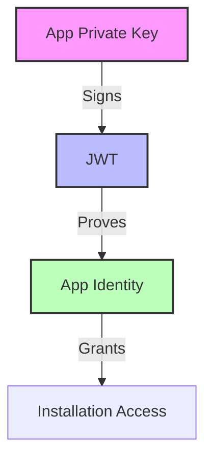
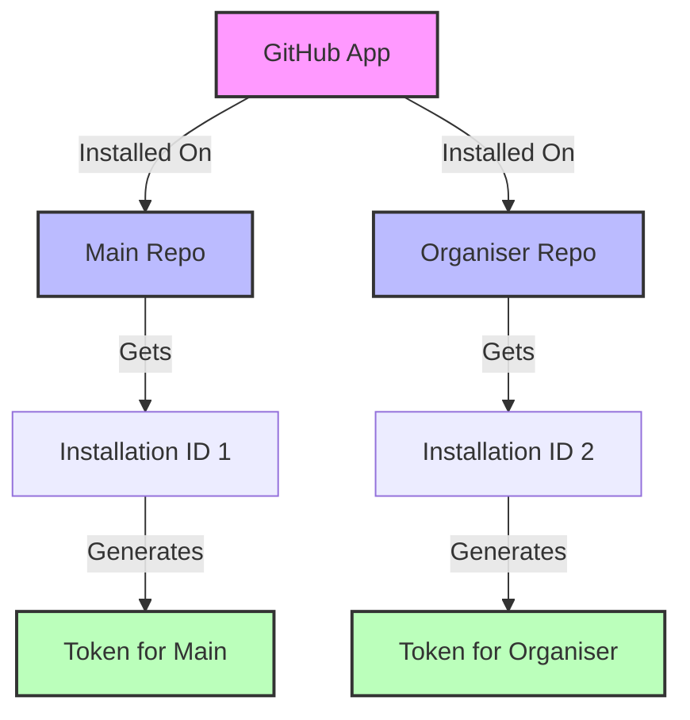
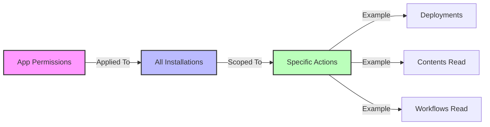
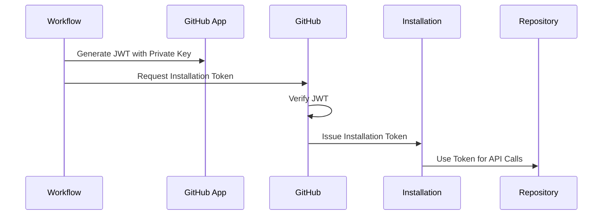
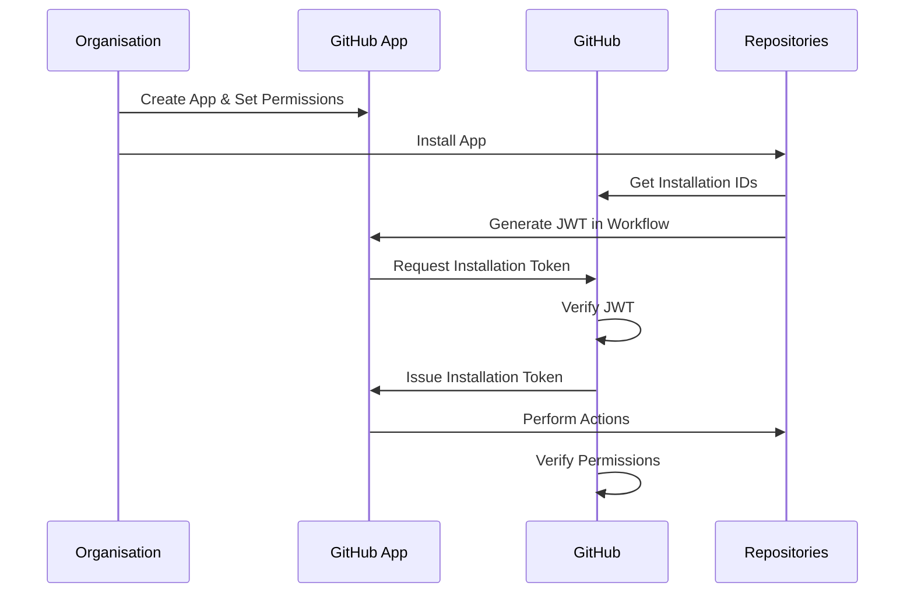

# GitHub App Trust Model

This document explains how GitHub's trust model works for GitHub Apps, particularly focusing on how apps can securely interact with repositories they're installed on.

## Overview

GitHub Apps use a three-tier trust model:
1. App Identity (Private Key)
2. Installation Access (Installation Tokens)
3. Repository Permissions (Scoped Access)

## Trust Layers

### 1. App Identity

The app's private key is its primary identity:
- Generated when the app is created
- Never shared with GitHub
- Used to sign JWTs that prove the app's identity
- Can be used to generate installation tokens for any installation of the app

### 2. Installation Access

Each installation of an app:
- Has its own unique installation ID
- Can generate installation-specific tokens
- Tokens are scoped to that installation
- Tokens expire after 1 hour

### 3. Repository Permissions

The app's permissions are:
- Defined when the app is created
- Applied to all installations
- Can be modified by organisation admins
- Scoped to specific actions (e.g., deployments)

### 3. Token Generation

The token generation process:
1. Workflow generates a JWT token using the private key
2. JWT token is used to request an installation token
3. GitHub verifies the JWT and issues an installation token
4. Installation token is used for API calls

## Trust Flow

## Security Benefits

1. **Identity Verification**:
   - Private key proves app identity
   - JWTs are short-lived
   - Tokens are installation-specific

2. **Permission Control**:
   - Granular permission settings
   - Installation-specific access
   - Organisation-level management

3. **Access Revocation**:
   - Can revoke app access
   - Can revoke installation
   - Can modify permissions

## References

- [GitHub Apps Documentation](https://docs.github.com/en/developers/apps)
- [GitHub App Permissions](https://docs.github.com/en/developers/apps/managing-permissions-and-access-for-github-apps)
- [GitHub App Authentication](https://docs.github.com/en/developers/apps/building-github-apps/authenticating-with-github-apps)
